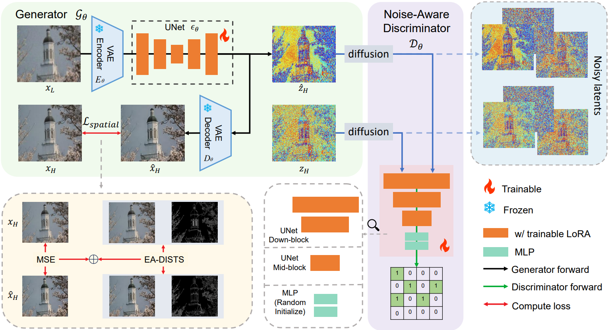
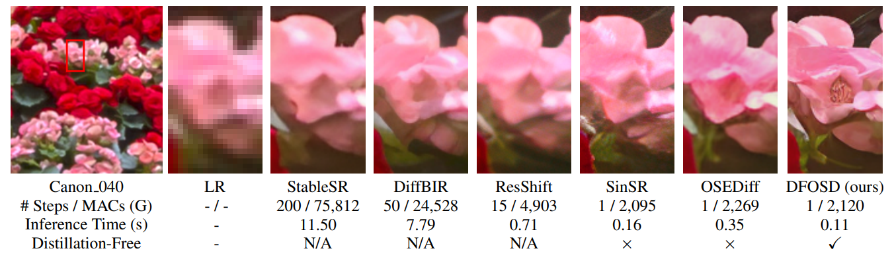
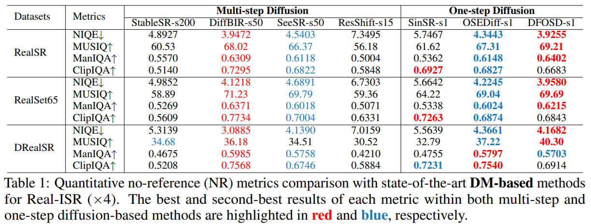
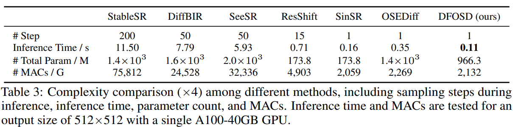
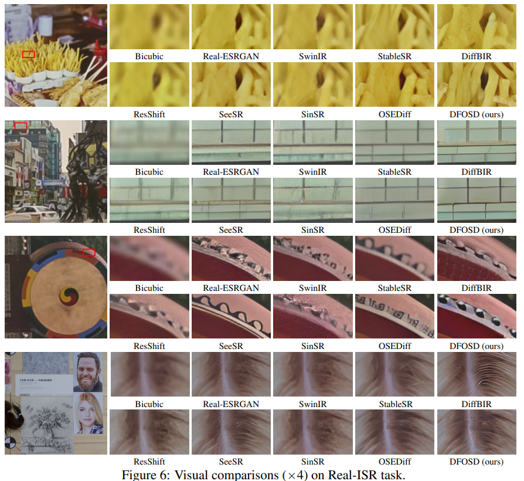

# DFOSD: Distillation-Free One-Step Diffusion for Real-World Image Super-Resolution

Jianze Li, [Jiezhang Cao](https://www.jiezhangcao.com/), Zichen Zou, Xiongfei Su, Xin Yuan, [Yulun Zhang](http://yulunzhang.com/), [Yong Guo](https://www.guoyongcs.com/), and [Xiaokang Yang](https://scholar.google.com/citations?user=yDEavdMAAAAJ), "Distillation-Free One-Step Diffusion for Real-World Image Super-Resolution", arXiv, 2024

[[arXiv](https://arxiv.org/pdf/2410.04224)] [[supplementary material](https://github.com/JianzeLi-114/DFOSD)] [visual results] [models]


> **Abstract:** Diffusion models have been achieving excellent performance for real-world image super-resolution (Real-ISR) with considerable computational costs. Current approaches are trying to derive one-step diffusion models from multi-step counterparts through knowledge distillation. However, these methods incur substantial training costs and may constrain the performance of the student model by the teacher's limitations. To tackle these issues, we propose DFOSD, a Distillation-Free One-Step Diffusion model. Specifically, we propose a noise-aware discriminator (NAD) to participate in adversarial training, further enhancing the authenticity of the generated content. Additionally, we improve the perceptual loss with edge-aware DISTS (EA-DISTS) to enhance the model's ability to generate fine details. Our experiments demonstrate that, compared with previous diffusion-based methods requiring dozens or even hundreds of steps, our DFOSD attains comparable or even superior results in both quantitative metrics and qualitative evaluations. Our DFOSD also abtains higher performance and efficiency compared with other one-step diffusion methods.


Training framework of DFOSD.

<p align="center">
  
</p>
Visual comparisons (x4) of different DM-based Real-ISR methods, including their inference times and MACs (Multiply-Accumulate Operations), for an output size of 512x512. The inference times are measured on an A100 GPU.

---

## ⚒️ TODO

* [ ] Complete this repository

## 🔗 Contents

- [ ] Quick Inference
- [ ] Train
- [x] [Results](#Results)
- [x] [Citation](#Citation)
- [x] [Acknowledgements](#Acknowledgements)

## 🔎 Results

<details>
<summary>DFOSD achieves superior performance on Real-world datasets. (click to expand)</summary>

- Quantitative no-reference (NR) metrics comparison with state-of-the-art DM-based methods for Real-ISR (&times;4). 
<p align="center">
  
</p>

</details>

<details>
<summary>DFOSD achieves the fastest inference speed. (click to expand)</summary>

- Complexity comparison (&times;4) among different DM-based methods.
<p align="center">
  
</p>

</details>

<details>
<summary>Visual Results. (click to expand)</summary>

- Visual comparisons (&times;4) on Real-ISR task.
<p align="center">
  
</p>

</details>

## Citation

If you find the code helpful in your research or work, please cite the following paper(s).
```
@article{li2024distillation,
  title={Distillation-Free One-Step Diffusion for Real-World Image Super-Resolution},
  author={Li, Jianze and Cao, Jiezhang and Zou, Zichen and Su, Xiongfei and Yuan, Xin and Zhang, Yulun and Guo, Yong and Yang, Xiaokang},
  journal={arXiv preprint arXiv:2410.04224},
  year={2024}
}
```

## 💡 Acknowledgements

[TBD]
